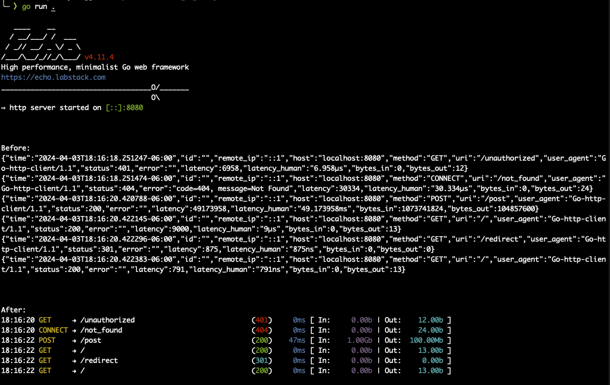

# PrettyLogger for Echo

PrettyLogger is a middleware for the Echo web framework that enhances the visibility of server logs through color-coded and formatted output. It's designed to improve the readability of logs by highlighting different aspects of HTTP requests and responses such as status codes, method types, and data transfer sizes.



## Features

- **Color-Coded Output**: Uses ANSI color codes to differentiate between HTTP methods, status codes, and other log components for quick visual parsing.
- **Formatted Path and Method Display**: Ensures consistent formatting for request paths and methods, including truncation with ellipses for long paths.
- **Readable Data Sizes**: Converts byte counts into a more readable format (b, Kb, Mb, Gb) for both incoming and outgoing data.
- **Performance Timing**: Logs the duration of each request in milliseconds, helping identify slow endpoints.

## Usage

To use PrettyLogger in your Echo project, follow these steps:

1. Import the PrettyLogger package into your Echo application.
2. Add the `Logger` function as middleware to your Echo instance.

Example:

```go
package main

import (
    "github.com/labstack/echo/v4"
    "github.com/rdbell/echo-pretty-logger"
)

func main() {
    e := echo.New()

    // Add PrettyLogger middleware
    e.Use(prettyLogger.Logger)

    // Define your routes
    e.GET("/", func(c echo.Context) error {
        return c.String(http.StatusOK, "Hello, World!")
    })

    // Start server
    e.Start(":8080")
}
```

## Demo
To demo PrettyLogger's capabilities, navigate to the [`example`](/example) folder within this repository and run `go run main.go` in your terminal. This command will launch an Echo server demonstrating the middleware's color-coded and formatted logging output.

## Configuration

Currently, PrettyLogger does not require any configuration and works out of the box by providing sensible defaults for logging HTTP requests and responses. It automatically handles different HTTP methods, status codes, and content sizes in a visually distinct manner.

## Contribution

Contributions are welcome! If you'd like to improve PrettyLogger or suggest new features, feel free to fork the repository, make your changes, and submit a pull request.

# License

This project is licensed under the MIT License. See the [LICENSE](/LICENSE) file for more details.
